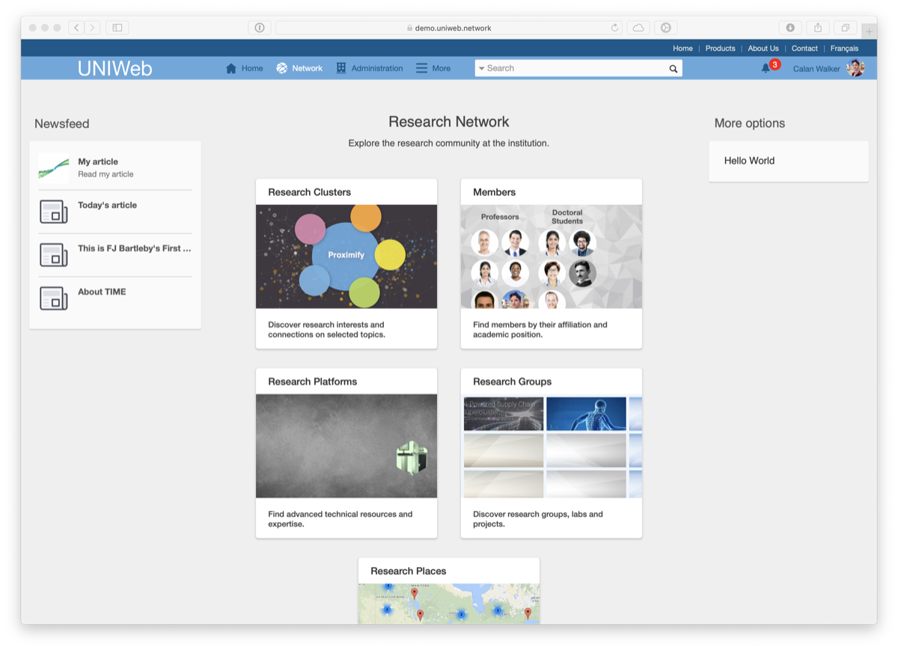
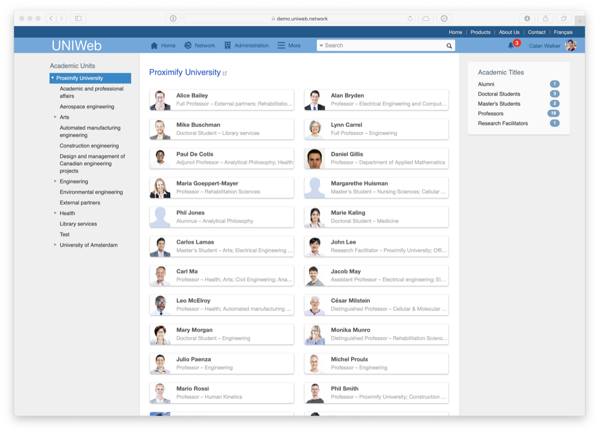

# UNIWeb's Main Areas

#### On this page:

* [The Home Page](navigating-uniweb.md#the-home-page)
* [The Network Page](navigating-uniweb.md#the-network-page)
* [The Members Page](navigating-uniweb.md#the-members-page)
* [The Administration Page](https://app.gitbook.com/@proximify/s/uniweb-docs/~/drafts/-LnYEzOBp5J6ui_Qtfpl/primary/introduction/navigating-uniweb/navigating-uniweb#the-administration-page)

## The Home Page

The Home Page is a dashboard combining specialized sections where you can populate and maintain your account information, profile and curriculum vitae. The Home page also includes tools to create and manage new Groups and Resources. It is the first screen that you will see when you log in to your UNIWeb account.

The Home page has seven sections, as listed below:

### Profile

The Profile section allows you to create a public profile on UNIWeb, in order to connect with other UNIWeb members and showcase your research interests and academic achievements. You can also manage parts of your UNIWeb account and membership information.

From the Profile section, you can:

* [Fill out your public profile](../networking-on-uniweb/filling-out-your-public-profile.md#filling-out-your-public-profile-manually)
* [Create new Research Themes](../networking-on-uniweb/research-themes/managing-research-themes.md#creating-new-research-themes)
* [Add publications to your public profile](../networking-on-uniweb/research-themes/increasing-discoverability-with-research-themes.md#tagging-your-publications-with-research-themes)
* [Add Research Places to your public profile](../networking-on-uniweb/research-places-1.md)
* [Edit your membership information](../uniweb-accounts/account-management/member-account-information.md#editing-your-account-information)
* [Join a secondary academic unit \(cross appointment\)](../uniweb-accounts/academic-units/cross-appointments.md#adding-a-cross-appointment-to-your-uniweb-account)
* Change your account password

### Connections

The Connections section allows you to browse your connections to other UNIWeb members, based on your position title,  your academic unit, and the research themes that you have added to your profile.

### Curriculum Vitae

The Curriculum Vitae section allows you to populate your academic CV, which you can use to create annual activity reports and other documents for your institution, and which you can export directly to the Canadian Common CV to apply to funding opportunities.

From the Curriculum Vitae section, you can:

* [Populate your Curriculum Vitae manually](../your-academic-information/your-uniweb-curriculum-vitae-cv.md#populating-your-curriculum-vitae-manually)
* [Import information from the Canadian Common CV](../your-academic-information/your-uniweb-curriculum-vitae-cv.md#importing-from-the-canadian-common-cv)
* [Export information to the Canadian Common CV](../your-academic-information/applying-for-funding-with-the-canadian-common-cv.md#exporting-cv-information-from-uniweb)
* [Download your Curriculum Vitae and report documents](../your-academic-information/downloading-cvs-and-reports.md#downloading-your-own-cv-and-report-files)

### Publications

The Publications section offers a dedicated area to create records of your academic publications, in order to include them in your Curriculum Vitae or public profile. You can populate your publications manually, or import them from various external sources, including Google Scholar, BibTex, PubMed, and EndNote.

From the Publications section, you can:

* [Create, edit, and delete publication records](../your-academic-information/publications-1.md#adding-publications-manually)
* [Tag publications with research interests to include them in your profile](../networking-on-uniweb/research-themes/increasing-discoverability-with-research-themes.md#tagging-your-publications-with-research-themes)
* Search for and remove duplicate publication records

### Groups

The Groups section allows you to quickly access the [Research Groups](../networking-on-uniweb/groups-1.md) that you've joined, and create and manage new Research Groups.

### Resources

The Resources section allows you to create and manage your the [Resources](../networking-on-uniweb/equipment-profiles-resources/) that you have made available within your UNIWeb network. 

### Tutorials

In the Tutorials section, you can find support documentation, frequently-asked-questions, and videos to help you get the most out of UNIWeb.

## The Network Page

The Network page is the main landing page of your UNIWeb network, and is the first page that visitors will see upon accessing the network. In addition to your network's [newsfeed](../networking-on-uniweb/web-articles-1.md), the Network page includes quick access to the public areas of your UNIWeb network, including Research Clusters, the Members page,[ Resources](../networking-on-uniweb/equipment-profiles-resources/), [Groups](../networking-on-uniweb/groups-1.md), and [Research Places](../networking-on-uniweb/research-places-1.md).

## The Members Page

The Members page is a full, publicly-accessible list of the members of your UNIWeb network. Members can be filtered by academic unit in the left panel, and by academic title on the right. Clicking on a member will lead to their [public profile](../networking-on-uniweb/filling-out-your-public-profile.md).

## The Administration Page

The Administration Page is a dashboard combining specialized sections where UNIWeb administrators can perform various administrative tasks. The Administration Page will only be available to you if you have been assigned an administrator role.

The Administration Page has eight main sections, as listed below. You will only see the sections that correspond to the permissions that you have been granted through the [administrator roles](../uniweb-accounts/access-control/managing-administrator-roles-and-permissions.md) that were assigned to you. If you feel that you need access to one of the sections below to perform administrative tasks for your academic unit, please contact a system administrator.

### Members

The Members section of UNIWeb provides a full list of your network’s users, along with tools for account management and communication.

From the Administration &gt; Members section, you can:

* [Create new member accounts](../uniweb-accounts/account-management/account-creation.md#creating-uniweb-member-accounts-manually)
* [Edit membership information for other members](../uniweb-accounts/account-management/member-account-information.md#editing-the-account-information-of-other-uniweb-members)
* [Delete member accounts](../uniweb-accounts/account-management/account-deletion.md#deleting-a-uniweb-members-account)
* [Send password reset emails](../uniweb-accounts/account-management/account-login.md#sending-a-password-reset-email-to-a-uniweb-member)
* [Send account invitation and reminder emails](../uniweb-accounts/account-management/account-creation.md#sending-account-activation-emails)
* [Download other members’ CV and report files](../your-academic-information/downloading-cvs-and-reports.md#downloading-the-cv-and-report-files-of-other-uniweb-members)
* [Populate other members’ public profiles](../networking-on-uniweb/filling-out-your-public-profile.md#filling-out-another-uniweb-members-public-profile)

### Web Articles

The Web Articles section allows you to create web articles that are displayed on the [UNIWeb Network](navigating-uniweb.md#the-network-page) page, in the newsfeed.

### Research Themes

The Research Themes section provides an overview of your UNIWeb instance’s Research Themes and the structure of their hierarchy.

From the Research Themes section, you can:

* [Approve proposed research themes](../networking-on-uniweb/research-themes/managing-research-themes.md#approving-research-themes)
* [Edit research themes](../networking-on-uniweb/research-themes/managing-research-themes.md#editing-research-themes)
* [Delete research themes](../networking-on-uniweb/research-themes/managing-research-themes.md#deleting-research-themes)

### Academic Metrics

Visualize statistical information about members. Create lists and reports.

### Academic Units

The Academic Units section provides an overview of your institution's academic units as they are organized in UNIWeb. 

From the Academic Units section, you can:

* [Create, edit, and delete academic units](../uniweb-accounts/academic-units/managing-academic-units.md#create-an-academic-unit-manually)
* [Change how academic units are nested and organized](../uniweb-accounts/academic-units/managing-academic-units.md#edit-an-academic-unit)
* [Create different types of academic units](../uniweb-accounts/academic-units/managing-academic-units.md#add-a-unit-type)
* [Add and remove UNIWeb members from secondary academic units \(cross-appointments\)](../uniweb-accounts/academic-units/cross-appointments.md#adding-cross-appointees-to-academic-units)

### Access Control

The Access Control section allows you to define the administrator roles that dictate which users have the ability to perform administrative tasks within your UNIWeb instance, and allows you to assign those roles to your peers as necessary.

From the Access Control section, you can:

* [Create, edit, and delete administrator roles](../uniweb-accounts/access-control/managing-administrator-roles-and-permissions.md#creating-administrator-roles)
* [Assign administrator roles to UNIWeb members](../uniweb-accounts/access-control/managing-administrators.md#granting-administrator-access)
* [Remove administrator roles from UNIWeb members](../uniweb-accounts/access-control/managing-administrators.md#removing-administrator-access)

### API Access

The API Access section allows you to manage UNIWeb's integrations with third-party services.

### Data and Report Templates

The Data Reports and Templates section allows you to view the sets of mapping rules, called _schemas_, that generate UNIWeb's data entry forms and tell UNIWeb what information to include when generating CV and report documents. Generally, if a UNIWeb user indicates that their CV or report document is missing some information, cross-referencing that report's schema will show why a certain record was not included in the exported file.

