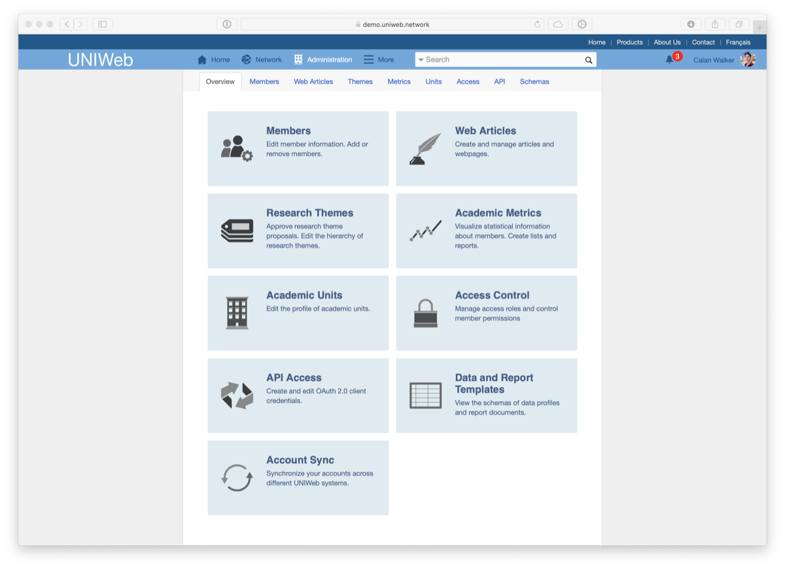

# Navigating UNIWeb

#### On this page:

* [The Home Page](navigating-uniweb.md#the-home-page)
* [The Network Page](navigating-uniweb.md#the-network-page)
* [The Members Page](navigating-uniweb.md#the-members-page)
* [The Administration Page](https://app.gitbook.com/@proximify/s/uniweb-docs/~/drafts/-LnYEzOBp5J6ui_Qtfpl/primary/introduction/navigating-uniweb/navigating-uniweb#the-administration-page)

## The Home Page

## The Network Page

## The Members Page

## The Administration Page

The Administration Page has six main sections, as listed below, but you will only see the sections that correspond to the permissions that you have been granted through the administrator roles that were assigned to you. If you feel that you need access to one of the sections below to perform administrative tasks for your academic unit, please contact a system administrator.

#### Members

The Members section of UNIWeb provides a full list of your network’s users, along with tools for account management and communication.

From the Administration &gt; Members section, you can perform tasks such as:

* Creating new member accounts
* Deleting member accounts
* Editing member information
* Sending password reset emails
* Sending account invitation and reminder emails
* Downloading other members’ CV and report files
* Populating other members’ public profiles

#### Research Themes

The Research Themes section provides an overview of your UNIWeb instance’s Research Themes and how they are organized into a hierarchy.

From the Research Themes section, you can perform tasks such as:

* Approving proposed research themes
* Editing research themes
* Deleting research themes

#### Academic Metrics

Visualize statistical information about members. Create lists and reports.

#### Academic Units

Edit the profile of academic units.

#### Access Control

Manage access roles and control member permissions.

#### API Access

Create and edit API client credentials.

2.11. Filtering members A variety of tasks, such as downloading reports, sending password resets, or sending a generic message are performed by first selecting the member\(s\). The list of members can be very long, but there is no need to scroll through it and manually find every person that you need. In order to efficiently perform actions on the members in your unit\(s\), there are a variety of ways to sort through the list of members. Firstly, you can filter the list based on the academic title or academic unit. If you want the entire department of Environment, select that academic unit in the drop-down and check All. Now you can send password resets, or download the CVs, for all the selected members. If you only want the professors in the department, select “Professor” in the academic title drop- down. This will narrow the options to just the professors in that unit. While sorting using academic unit and academic title can be very powerful, UNIWeb also allows precise searches for users based on their names. You can search for multiple people at once by typing the names separated with a semicolon. For example, a search of “M ; W” will result in all the users with a last name that starts with M or W. Type more of the names to get more specific. If you want to search first names, put a comma before typing the name. For example, a search of “,K” will result in everyone who has a first name that starts with a K. These operators can be combined to get the results that you need with little effort. Search “Mac ; , Al” \(See Figure 7\) This will result in all the people with the last name that starts with Mac, and all the people whose first name starts with Al. www.uniweb.network UNIWeb Administrator Guide 11 Figure 7 Using filters and searches among members. Semicolons separate searches and commas indicate a first name. This search can be further refined. If you want a search that includes both the first and last name, write “ Mac, G”. The search of Mac is further narrowed by adding “, G”. The search is asking for a person whose last name starts with Mac and the first name starts with G. A semicolon will allow you to search for additional people by both first and last name. The search item “Mac, G; S, Al” narrows the results in this example to just Gale Macmillan and Albert Smith. These searches are quick to perform when you need data on multiple people that aren’t easily sorted using the other filters.

