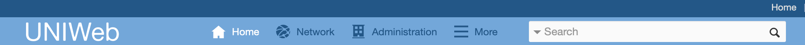

# Navigation d'UNIWeb

Les domaines principaux d'UNIWeb se compose de quatre pages qui agissent comme des tableaux de bord, qui vous conduisent à des outils spécialisés au sein de la plateforme. La [Page d'accueil](the-home-page.md), par exemple, vous permet de gérer vos propres informations et actifs au sein du réseau UNIWeb. The [Network page](the-network-page.md) serves to help you browse and connect to resources available through your institution's UNIWeb network. The [Members page](the-members-page.md) allows you to browse and search for specific members of your UNIWeb network. The [Administration page](./#the-administration-page), which is only visible if you have been granted an administrator role in your UNIWeb network, houses tools that  allow you to process administrative tasks for your academic unit, view and download academic metrics, and help your colleagues manage their accounts and information.

The step-by-step procedures outlined in this help centre will generally start by directing you to one of these four pages. They are linked in UNIWeb's main navigation bar at the top of the page, and are always accessible no matter where you are in UNIWeb.


**Tip:** If you have been granted an administrator role, the link to the administration page will only be visible once you have logged in, and will take the place of the link to the Members page. The Members page remains linked within the **More** button, next to the search bar.


#### In this section:

* [The Home Page](the-home-page.md)
* [The Network Page](the-network-page.md)
* [The Members Page](the-members-page.md)
* [The Administration Page](the-administration-page.md)

