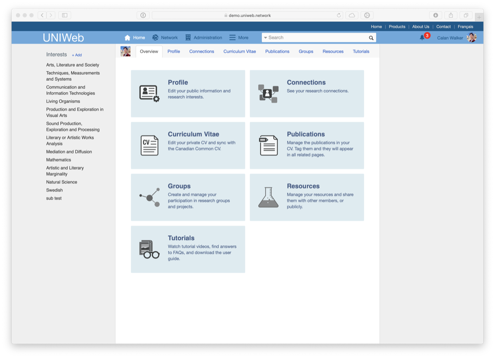

# Page d'accueil

La page d'accueil d'UNIWeb est le premier écran que vous verrez lorsque vous vous connectez à votre compte UNIWeb. Il s'agit d'un tableau de bord qui combine des sections spécialisées où vous pouvez remplir et gérer les informations de votre compte, votre profil et votre curriculum vitae. La page d'accueil comprend également des outils pour créer et gérer de nouveaux groupes de recherche et profils de ressources.

#### La page d'accueil comprend sept sections, comme indiqué ci-dessous :

* [Profil](the-home-page.md#profil)
* [Liens](the-home-page.md#connections)
* [Curriculum Vitae](the-home-page.md#curriculum-vitae)
* [Publications](the-home-page.md#publications)
* [Groupes](the-home-page.md#groups)
* [Resources](the-home-page.md#resources)
* [Tutoriels](the-home-page.md#tutorials)

## **Profil**

La section Profil vous permet de [**créer un profil publique sur UNIWeb**](../networking-on-uniweb/filling-out-your-public-profile.md), afin de vous connecter avec d'autres membres d'UNIWeb et de mettre en valeur vos intérêts de recherche et vos résultats académiques. Vous pouvez également gérer des parties de votre compte UNIWeb et des informations d'adhésion.

À partir de la section profil, vous pouvez :

* [Remplir votre profil publique](../networking-on-uniweb/filling-out-your-public-profile.md#filling-out-your-public-profile-automatically-using-your-cv) 
* [Creation d'un nouveau thème de recherche](../networking-on-uniweb/research-themes/managing-research-themes.md#creating-new-research-themes)
* [Ajouter des publications à votre profil publique ](../networking-on-uniweb/research-themes/increasing-discoverability-with-research-themes.md#tagging-your-public-profile-with-research-themes)
* [Ajouter des lieux de recherche à votre profil publique ](../networking-on-uniweb/research-places-1.md)
* [Modifications sur votre information de membre](../uniweb-accounts/account-management/member-account-information.md)
* [Rejoindre une unité académique secondaire \(nomination croisée\)](../uniweb-accounts/academic-units/cross-appointments.md) 
* [Changer votre mot de passe](../uniweb-accounts/account-management/account-login.md#updating-your-uniweb-account-password)

## Liens

La section Connexions vous permet de [parcourir vos connexions avec les autres membres d'UNIWeb](../networking-on-uniweb/research-themes/research-connections.md), en fonction de votre titre de poste, de votre unité académique et des thèmes de recherche que vous avez ajoutés à votre profil.

## Curriculum Vitae

La section Curriculum Vitae vous permet de [remplir et gérer votre CV académique](../your-academic-information/your-uniweb-curriculum-vitae-cv.md), que vous pouvez utiliser pour créer des rapports d'activité annuels et d'autres documents pour votre institution, et que vous pouvez exporter directement dans le CV commun canadien pour postuler aux compétitions de financement.

À partir du section Curriculum Vitae, vous pouvez :

* [Remplir votre Curriculum Vitae manuellement](../your-academic-information/your-uniweb-curriculum-vitae-cv.md#remplir-votre-curriculum-vitae-manuellement)
* [Importer de l'information à partir du CV commun canadien](../your-academic-information/your-uniweb-curriculum-vitae-cv.md#importing-from-the-canadian-common-cv)
* [Exporter de l'information vers le CV commun canadien](../your-academic-information/applying-for-funding-with-the-canadian-common-cv.md#exporting-cv-information-from-uniweb)
* [Télécharger votre CV et vos rapports](../your-academic-information/downloading-cvs-and-reports.md#downloading-your-own-cv-and-report-files)

## Publications

La section Publications vous offre un endroit dédié à la ****[**création d'archives de vos publications académiques**](../your-academic-information/publications-1.md), in order to include them in your Curriculum Vitae or public profile. You can populate your publications manually, or import them from various external sources, including Google Scholar, BibTex, PubMed, and EndNote.

From the Publications section, you can:

* [Create, edit, and delete publication records](../your-academic-information/publications-1.md#adding-publications-manually)
* [Tag publications with research interests to include them in your profile](../networking-on-uniweb/research-themes/increasing-discoverability-with-research-themes.md#tagging-your-publications-with-research-themes)

## Groupes

The Groups section allows you to quickly access the [Research Groups](../networking-on-uniweb/groups-1.md) that you've joined, and create and manage new Research Groups.

## Resources

The Resources section allows you to create and manage the [Resources](../networking-on-uniweb/equipment-profiles-resources/) that you have made available within your UNIWeb network. 

## Tutoriels

In the Tutorials section, you can find support documentation, frequently-asked-questions, and videos to help you get the most out of UNIWeb.

