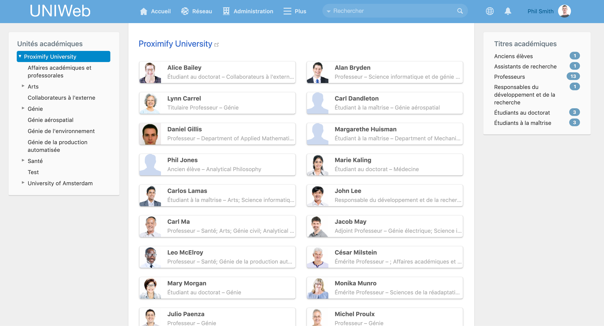

# La page des membres

## La page des membres

La page des membres est une **liste, complète et accessible au publique, de membres de votre réseaux UNIWeb**. Les membres peuvent être filtrés par unité académique dans le panneau de gauche et par titre académique à droite. En cliquant sur un membre, nous pouvons voir leur[ profil publique](../networking-on-uniweb/filling-out-your-public-profile.md).

