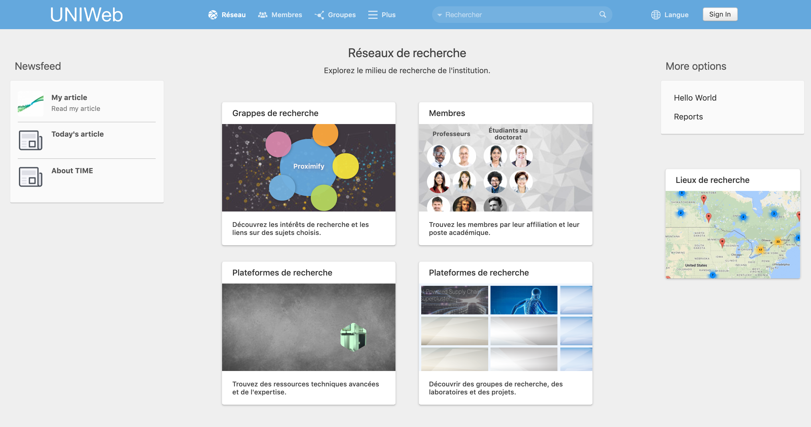

# La page du réseau

La page Réseau est la **page d'accueil principale de votre réseau UNIWeb**, et c'est la première page que les visiteurs verront lors de leur accès au réseau. En plus du [newsfeed](../networking-on-uniweb/web-articles-1.md) de votre réseau, la page Réseau comprend un accès rapide aux zones publiques de votre réseau UNIWeb, y compris les clusters de recherche, la page Membres, [Équipements](../networking-on-uniweb/equipment-profiles-resources/), [Groupes de recherche](../networking-on-uniweb/groups-1.md) et [Lieux de recherche](../networking-on-uniweb/research-places-1.md). 

