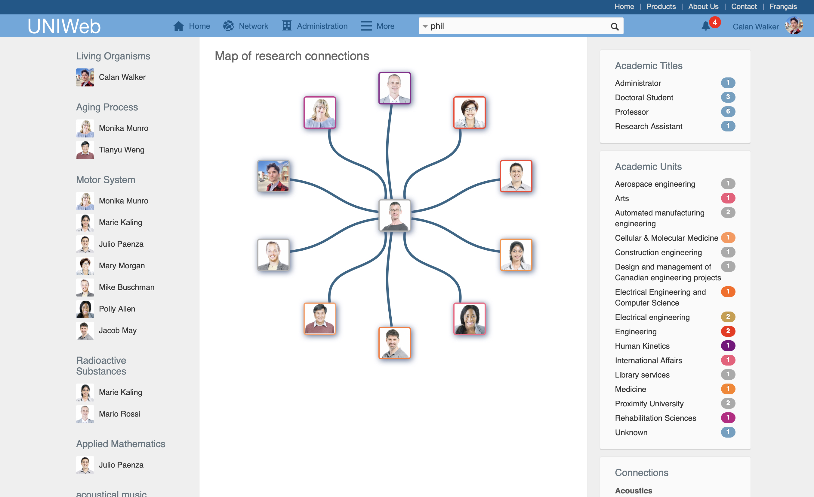

# Networking on UNIWeb

In addition to offering intuitive tools to create and manage a digital copy of your [academic curriculum vitae](../your-academic-information/), UNIWeb offers robust tools to discover and connect with peers, and to stay in the loop with the [latest news](web-articles-1.md) at your institution.

To start, you can curate the information that you have entered into your academic CV into a [public profile,](filling-out-your-public-profile.md) a representation of your presence and work at your institution. Within your UNIWeb network, you can list academic [resources and equipment](equipment-profiles-resources/) under your management to be discovered and shared by your peers, and you can create [Research Groups](groups-1.md) to organize and share resources with your colleagues.

UNIWeb allows you to tag your groups, resources, publications and even your profile with [Research Themes](research-themes/) - keywords that can help you find potential collaborators and research equipment suited to a particular topic, and that can help you boost the discoverability of your own listings in search results accordingly. Every Research Theme has its own Research Cluster, a page full of resources that have been tagged with the same Theme, to help you discover everything your institution has listed under a particular topic.

## In this chapter:

* [Your Public Profile](filling-out-your-public-profile.md)
* [Research Themes](research-themes/)
* [Research Places](research-places-1.md)
* [Resources](equipment-profiles-resources/)
* [Groups](groups-1.md)
* [Web Articles](web-articles-1.md)

