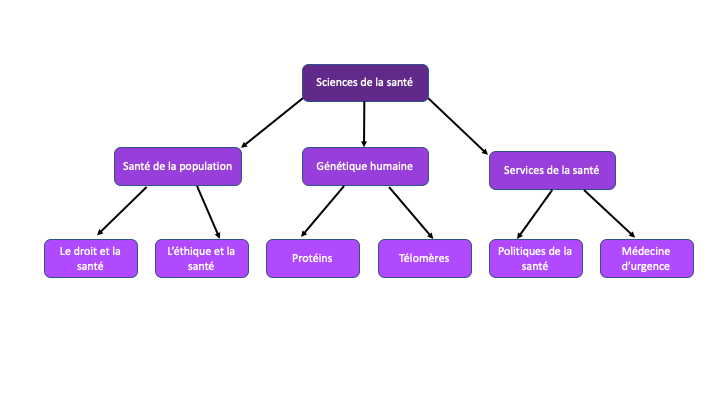

# Thèmes de recherche

Alors que les [unités académiques](../../uniweb-accounts/academic-units/) organisent les membres d'UNIWeb par les véritables organes administratifs qui composent leur institution, les thèmes de recherche servent à connecter les membres d'UNIWeb au-delà des limites des unités académiques, en fonction de leurs intérêts de recherche et des sujets qui éclairent leur travail académique.

Les thèmes de recherche agissent comme des **mots clés** qui peuvent être [_étiquetés_](increasing-discoverability-with-research-themes.md) sur divers éléments d'UNIWeb, tels que des [publications](../../your-academic-information/publications-1.md), des [lieux de recherche](../research-places-1.md), des [équipements](../equipment-profiles-resources/), des [groupes](../groups-1.md), et même votre [profil publique](../filling-out-your-public-profile.md). Une fois un élément balisé, il apparaîtra dans les clusters de recherche et les résultats de recherche sur le réseau. [Étiqueter des thèmes de recherche à votre profil](increasing-discoverability-with-research-themes.md#tagging-your-public-profile-with-research-themes) pour indiquer vos intérêts de recherche permettra à UNIWeb de remplir une [carte de connection](research-connections.md) personnalisée pour vous aider à trouver des pairs qui ont marqué leurs propres profils de la même manière. Grâce au balisage des thèmes de recherche, vous pouvez diffuser vous-même, vos recherches et vos publications dans votre établissement et découvrir des pairs qui ont travaillé sur des recherches dans des thèmes similaires, même s'ils sont dans des départements complètement différents.

Comme les unités académiques, les thèmes de recherche sont imbriqués, ce qui signifie que les thèmes parents sont décomposés en thèmes plus petits et plus spécifiques. Cela signifie que, bien que les unités académiques et les thèmes de recherche puissent partager certains noms, il est important de se rappeler que les unités académiques décrivent les départements et les facultés, et que les thèmes de recherche décrivent des sujets et des domaines d'études.

Chaque réseau UNIWeb est accompagné d'une liste complète et prédéfinie de thèmes de recherche provenant directement du CV commun canadien. Cependant, il n'y a pas deux institutions identiques dans la portée de leurs recherches, et vous avez donc également la possibilité [ajouter d'autres thèmes de recherche](managing-research-themes.md#creating-new-research-themes) supplémentaires si la liste standard ne comprend pas un thème particulier que vous souhaitez utiliser.

### Dans cette section:

* [Gestion de thèmes de recherche](managing-research-themes.md)
* [Étiqueter des thèmes de recherche](increasing-discoverability-with-research-themes.md)

