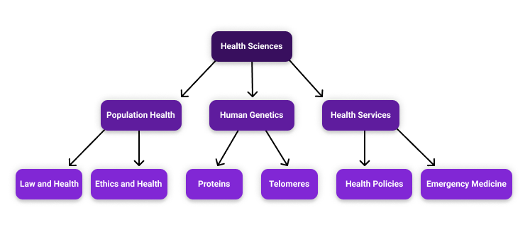

# Thèmes de recherche

Whereas [academic units](../../uniweb-accounts/academic-units/) organize UNIWeb members by the real administrative bodies that make up their institution, Research Themes serve to connect UNIWeb members across the boundaries of academic units, based on their research interests and the topics that inform their academic work. 

Research Themes act like **keywords** that may be [_tagged_](increasing-discoverability-with-research-themes.md) onto various items in UNIWeb, such as [publications](../../your-academic-information/publications-1.md), [research places](../research-places-1.md), [resources](../equipment-profiles-resources/), [groups](../groups-1.md), and even your [public profile](../filling-out-your-public-profile.md). Once an item is tagged, it will appear in Research Clusters and search results across the network. [Tagging Research Themes to your profile](increasing-discoverability-with-research-themes.md#tagging-your-public-profile-with-research-themes) to indicate your research interests will allow UNIWeb to populate a personalized [connection map](research-connections.md) to help you find peers who have tagged their own profiles similarly. Through Research Theme tagging, you can broadcast yourself, your research, and your publications to your institution, and discover peers who have been working on research in similar themes, even if they're in completely different departments.

Like academic units, Research Themes are nested, meaning that parent themes are broken down into smaller themes that are more specific. This means that while academic units and Research Themes might share some overlap in naming, it's important to remember that academic units describe departments and faculties, and Research Themes describe topics and fields of study.

Every UNIWeb network comes with an extensive, pre-defined list of Research Themes sourced directly from the Canadian Common CV. No two institutions are exactly alike in the scope of their research, however, and so you also have the option to [add additional Research Themes](managing-research-themes.md#creating-new-research-themes) if the standard list doesn't include a particular theme that you'd like to use. 

### In this section:

* [Managing Research Themes](managing-research-themes.md)
* [Tagging with Research Themes](increasing-discoverability-with-research-themes.md)

