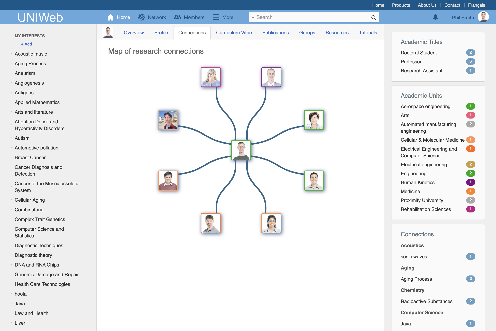
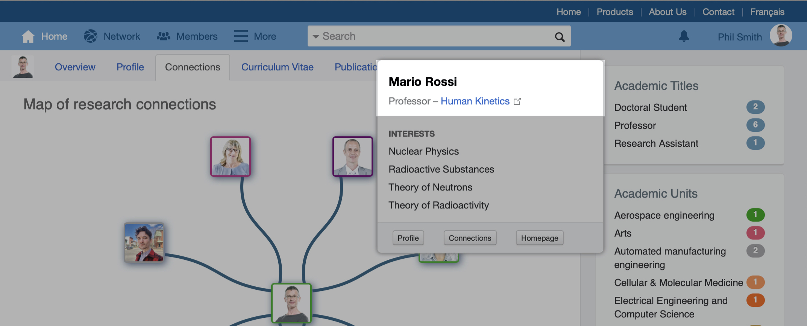
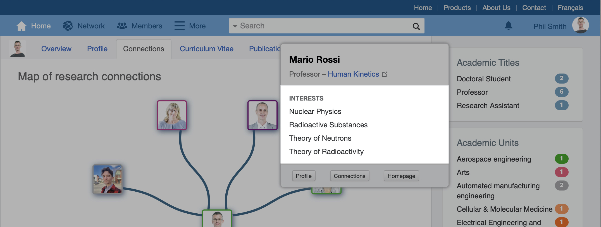
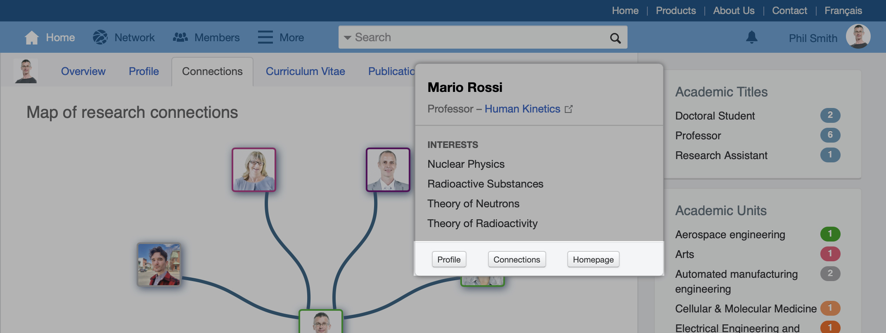
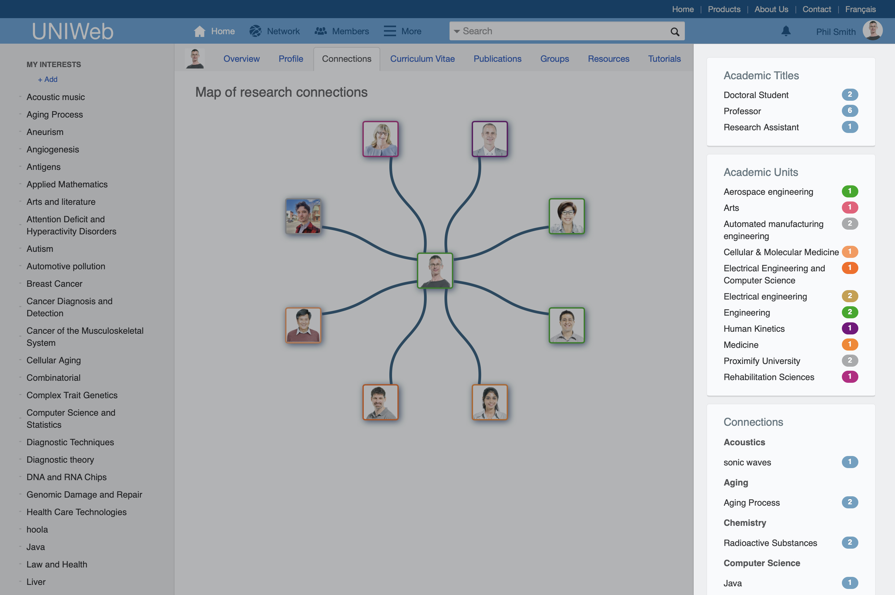

# Research Connections

Research institutions can involve vast amounts of people, all conducting research into a broad spectrum of fields of study. With so many colleagues at your institution, it's possible that another researcher in a completely different department or faculty could be researching a topic that's close to or relevant to your own, and you might never know. 

UNIWeb aims to help you break the silo walls between faculties by making it easier to find potential collaborators within your institution who are interested in the same [Research Themes](./), even if they are approaching their work from a different research perspective. 

Every time you [tag your profile with a Research Theme](increasing-discoverability-with-research-themes.md#tagging-your-public-profile-with-research-themes), UNIWeb finds other members of your UNIWeb network who have tagged their profile with the same theme, and its parents and children. UNIWeb collects and displays all of your connections on a Research Connections page that's tailored specifically for you. 

**On this page:**

* [Accessing your research connection map](research-connections.md#accessing-your-research-connection-map)
* [Viewing more information about a research connection](research-connections.md#viewing-more-information-about-a-specific-connection)
* [Filtering research connections](research-connections.md#filtering-research-connections)

## Accessing your Research Connection map

* From your UNIWeb Home page, go to **Connections**

In the centre panel, your profile picture is displayed in the middle of a web, showing all of the connections that UNIWeb was able to generate using the Research Themes that you have [tagged to your profile](increasing-discoverability-with-research-themes.md#tagging-your-public-profile-with-research-themes). Each person that you see connected to you has tagged at least one theme in common with you, or a parent or child of a theme in common with you.

## Viewing more information about a specific connection

To view more information about a specific person, **hover your cursor over their picture**. In the window that appears while hovering, you can:

* View their name, [academic title](../../uniweb-accounts/account-management/member-account-information.md#membership-information-fields), and main [academic unit](../../uniweb-accounts/academic-units/),

* View a selection of their profile's tagged Research Themes, and

* Open their profile, open their own connection map, or open their [homepage](../../uniweb-accounts/account-management/member-account-information.md#membership-information-fields), if they have listed one on their profile.  

## Filtering Research Connections

In the right panel of your research connections map, there are options to help you filter through your connections and find potential collaborators. 

You can filter your connections using three different parameters:

* By their [academic title](../../uniweb-accounts/account-management/member-account-information.md#membership-information-fields),
* By their [academic unit](../../uniweb-accounts/academic-units/), or
* By the research themes that you have in common with them.

**To activate a filter, click on a specific list item under that parameter. You can deactivate that filter by clicking on it again.** 


**TIp:** You can only activate one filter at a time per parameter, but to help you find specific results, **you can have one active filter from each of the three parameters at the same time**. For instance, you could filter your connections to find **professors** in **engineering** who are interested in **computer science.**


