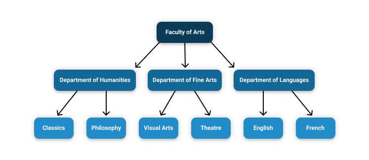

# Academic Units

Academic institutions are organized into various administrative bodies, such as faculties, departments, offices, and programs. Generally, these administrative bodies exist in a hierarchical structure. For instance, a **Faculty** of Arts may include **departments** for humanities, fine arts, and languages. These departments may in turn be composed of various **programs,** for classical studies, music, and English literature, respectively. In UNIWeb, each of these administrative bodies, from the faculty level down to the individual program, is an _**academic unit**_. 

The hierarchy of academic units defines the overall structure of the institution's UNIWeb network, and organizes its members and administrators by their real-world appointments. Every UNIWeb member account has a primary association with an academic unit, which will determine where other UNIWeb members can find them within the network. This will be reflected in areas that allow for filtering by academic unit, like the [Members page](../../introduction/navigating-uniweb.md#the-members-page) and [Research Clusters](), and in search results.

Academic units also serve to set boundaries for [UNIWeb administrator access](../access-control/managing-administrator-roles-and-permissions.md). Administrators may only perform administrative tasks, like [accessing member data](../../networking-on-uniweb/filling-out-your-public-profile.md#filling-out-another-uniweb-members-public-profile), [downloading reports](../../your-academic-information/exporting-academic-information/downloading-cvs-and-reports.md#downloading-cv-and-report-files-for-other-uniweb-members), viewing [academic metrics](../../academic-metrics/academic-metrics.md) and helping members [reset their passwords](../account-management/account-login.md#sending-a-password-reset-email-to-a-uniweb-member), within the academic unit that is assigned to their role, and the academic units that are nested below it.

As some UNIWeb users may hold positions within departments or faculties outside of their primary academic unit, these members can list themselves in secondary academic units through [**cross appointments**](cross-appointments.md), allowing administrators with the permissions over the secondary unit to treat the cross-appointee as a full member of that unit.

Every institution's hierarchy of academic units is unique, and so academic units can be [**created, edited, rearranged, and deleted**](cross-appointments.md) in UNIWeb as necessary to reflect structure of your institution as it grows over time.

### In this section:

* [Managing Academic Units](managing-academic-units.md)
* [Managing Cross-Appointments](cross-appointments.md)

